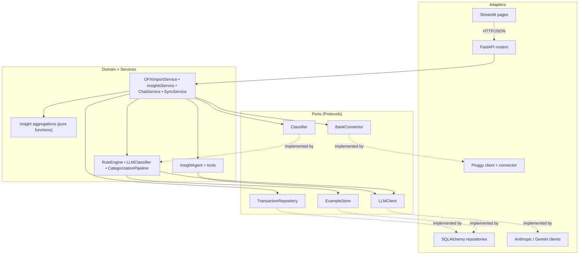

# Architecture

> Gastei is a single-user personal finance assistant built around a hexagonal core, a deterministic-before-probabilistic categorization pipeline, and a tool-using LLM chat agent. This document describes the system as built — design principles, contracts, data model, and the testing discipline that holds it together.

---

## 1. Overview

**What it is.** A personal app that ingests transactions (via OFX upload or Pluggy's Open Finance API), categorizes them using rules + LLM, and answers questions about your finances through chat.

**Non-goals.** Multi-tenant SaaS, mobile-native, brokerage integration (B3), payment initiation (PIX, transfers), formal LGPD compliance. This is single-user by design — see §2.

**Built specifically for Brazilian users.** Bank-code mappings (BACEN), categorization rules, taxonomy labels, and date/currency formatting target the Brazilian financial system. The codebase is in English; the YAML seed data and the chat agent's system prompt are in Portuguese because they are *user-facing content*, not implementation.

---

## 2. Design principles

These were deliberate constraints, not happy accidents. Reviewers should expect to see them honored throughout the codebase.

1. **Single-user first.** No auth, no RBAC, no multi-tenant scaffolding. The migration cost when those become real is a known and bounded refactor; the cost of pretending they're real on day one is permanent.
2. **SQLite until it hurts.** SQLite with WAL mode handles tens of thousands of transactions without breaking a sweat. Porting to Postgres is a `DATABASE_URL` change away the day it matters.
3. **Deterministic before probabilistic.** Rules cover ~60% of transactions at zero cost and zero latency. The LLM is the fallback, not the headline. This saves money, saves time, and produces explainable outputs for the rule path.
4. **Idempotency is a hard requirement.** Every transaction has a stable ID — Pluggy supplies one; OFX gets a deterministic SHA-256 hash of `(account_id, date, amount, normalized_description)`. Re-running an import 100 times never duplicates a row.
5. **Feedback loop is first-class.** Every manual recategorization in the UI is persisted as an `Example` and fed back to the LLM as a few-shot on the next batch. The system learns from corrections.
6. **Secrets vaulted from day one.** Credentials live in `.env` (gitignored). The optional `SECRET_KEY` powers Fernet encryption of any sensitive field that ends up at rest. Even for a personal app, the habit matters.
7. **Backend / frontend separation, even with Streamlit.** All business logic lives in `domain/` and `services/`. Streamlit is a thin rendering layer that calls the FastAPI backend over HTTP. Replacing Streamlit with Next.js requires no domain changes.
8. **Ports & Adapters (Hexagonal).** The core (`domain/` + `services/`) knows nothing about SQL, HTTP, Anthropic, Gemini, Pluggy, or Streamlit. It depends on **Protocols** (ports) defined in `domain/ports.py`. Concrete adapters in `clients/`, `repositories/`, `api/`, and `streamlit_app/` implement them. This is the architectural invariant; everything else falls out of it.
9. **TDD where the logic lives.** Domain and services are test-first. API, clients, and Streamlit accept post-fact tests because they are thin, visually volatile, or both. Full strategy in §8.

---

## 3. Technology stack

| Layer | Technology | Why |
|---|---|---|
| API | FastAPI + Pydantic v2 | Native async, schema validation, generated OpenAPI |
| ORM | SQLAlchemy 2.0 + Alembic | Modern declarative style, versioned migrations from day one |
| Database | SQLite (WAL) | Single-user, no admin overhead, swappable to Postgres |
| HTTP client | httpx | Async-native, the right primitive for the LLM and Pluggy clients |
| Scheduling | APScheduler | In-process scheduler, opt-in via `ENABLE_SCHEDULER` |
| LLM | Anthropic Claude **or** Google Gemini | Provider chosen via `LLM_PROVIDER`; both implement the same `LLMClient` port |
| Bank data | Pluggy (sandbox) + OFX/QFX parsing | Pluggy for production-style Open Finance; manual OFX as the realistic free path |
| Frontend (MVP) | Streamlit + Plotly | Zero-boilerplate UI for a single-user app |
| Tooling | uv, ruff, pytest, pre-commit | Modern Python toolchain; uv ships its own Python and lockfile |
| Containerization | Docker + docker-compose | Reproducible local + deploy targets |

**Deliberately not adopted.** LangChain or LlamaIndex (adds indirection for no benefit at this scale); ORM-mock libraries (brittle, mask mapping bugs — see §8); a separate formatter (ruff handles both linting and formatting).

---

## 4. High-level architecture

The hexagonal split is the most important diagram in this document. The rule is mechanical: anything in `domain/` or `services/` that imports from `gastei.clients.*`, `gastei.repositories.*`, `gastei.api.*`, or `sqlalchemy` is an architectural bug.



### Principal data flows

**Sync from a bank (Pluggy).**

```
APScheduler fires (configurable interval)
  → SyncService.sync_all()
      → BankConnector.list_items() → upsert into items
      → for each item: list_accounts() → upsert into accounts
      → for each account: list_transactions() → convert DTO → upsert into transactions
      → if a Classifier is configured: classify newly-inserted transactions
```

**Chat with a question.**

```
User sends "how much did I spend on delivery in April?"
  → POST /chat
      → ChatService persists the user message
      → InsightAgent.run(message)
          → LLMClient.messages_create with tools schemas
          → loop until stop_reason == "end_turn" or max_iterations:
              tool_use ⇒ dispatch to the registered Python callable
              end_turn ⇒ return text response
      → ChatService persists tool calls + assistant reply
```

**Manual correction (feedback loop).**

```
User edits a category in the Transactions page
  → PATCH /transactions/{id}
      → TransactionRepository.update_category(source="user")
      → ExampleStore.add(Example(description, amount, category))
      → next LLMClassifier call uses this example as few-shot
```

---

## 5. Data model

The full DDL lives in `alembic/versions/0001_initial_schema.py`. The shape is small and stable.

```sql
-- Bank connections (1 row = 1 institution)
CREATE TABLE items (
    id TEXT PRIMARY KEY,                  -- Pluggy itemId or "ofx-<bank_code>" for OFX-derived
    connector_id INTEGER NOT NULL,
    institution_name TEXT NOT NULL,
    status TEXT NOT NULL,                 -- UPDATED, OUTDATED, LOGIN_ERROR
    last_synced_at TIMESTAMP,
    next_auto_sync_at TIMESTAMP,
    created_at TIMESTAMP NOT NULL DEFAULT CURRENT_TIMESTAMP
);

-- Accounts within a connection (checking, savings, credit card)
CREATE TABLE accounts (
    id TEXT PRIMARY KEY,
    item_id TEXT NOT NULL REFERENCES items(id) ON DELETE CASCADE,
    type TEXT NOT NULL,                   -- CHECKING, SAVINGS, CREDIT
    subtype TEXT,
    name TEXT NOT NULL,
    number TEXT,
    balance REAL NOT NULL,
    currency_code TEXT NOT NULL DEFAULT 'BRL',
    updated_at TIMESTAMP NOT NULL
);
CREATE INDEX idx_accounts_item ON accounts(item_id);

-- Transactions
CREATE TABLE transactions (
    id TEXT PRIMARY KEY,                  -- Pluggy transactionId or deterministic OFX hash
    account_id TEXT NOT NULL REFERENCES accounts(id) ON DELETE CASCADE,
    date DATE NOT NULL,
    amount REAL NOT NULL,                 -- positive = inflow, negative = outflow
    description TEXT NOT NULL,
    description_raw TEXT,
    merchant_name TEXT,
    -- Categorization
    category TEXT,                        -- e.g. "alimentacao.delivery"
    category_source TEXT,                 -- 'rule', 'llm', 'user', 'pluggy'
    category_confidence REAL,             -- 0..1
    -- Audit
    pluggy_category TEXT,
    payment_method TEXT,                  -- PIX, TED, BOLETO, CREDIT_CARD, etc.
    created_at TIMESTAMP NOT NULL DEFAULT CURRENT_TIMESTAMP,
    updated_at TIMESTAMP NOT NULL DEFAULT CURRENT_TIMESTAMP
);
CREATE INDEX idx_tx_account_date ON transactions(account_id, date DESC);
CREATE INDEX idx_tx_category ON transactions(category);
CREATE INDEX idx_tx_uncategorized ON transactions(category) WHERE category IS NULL;

-- Category taxonomy (hierarchical via dot-notation)
CREATE TABLE categories (
    code TEXT PRIMARY KEY,                -- 'alimentacao.delivery'
    parent_code TEXT REFERENCES categories(code),
    label TEXT NOT NULL,
    icon TEXT,
    color TEXT,
    is_income BOOLEAN NOT NULL DEFAULT 0,
    is_investment BOOLEAN NOT NULL DEFAULT 0,
    is_transfer BOOLEAN NOT NULL DEFAULT 0
);

-- Deterministic categorization rules
CREATE TABLE rules (
    id INTEGER PRIMARY KEY AUTOINCREMENT,
    pattern TEXT NOT NULL,
    pattern_type TEXT NOT NULL,           -- 'substring', 'regex', 'merchant_exact'
    category TEXT NOT NULL REFERENCES categories(code),
    priority INTEGER NOT NULL DEFAULT 100,
    enabled BOOLEAN NOT NULL DEFAULT 1,
    created_at TIMESTAMP NOT NULL DEFAULT CURRENT_TIMESTAMP
);
CREATE INDEX idx_rules_priority ON rules(enabled, priority DESC);

-- Few-shot examples for the LLM (user corrections feed in here)
CREATE TABLE examples (
    id INTEGER PRIMARY KEY AUTOINCREMENT,
    description TEXT NOT NULL,
    amount REAL,
    category TEXT NOT NULL REFERENCES categories(code),
    source TEXT NOT NULL,                 -- 'user_correction', 'manual_seed'
    created_at TIMESTAMP NOT NULL DEFAULT CURRENT_TIMESTAMP
);
CREATE INDEX idx_examples_recent ON examples(created_at DESC);

-- Cached insights (reserved — not populated yet; aggregations are cheap at current scale)
CREATE TABLE insight_cache (
    key TEXT PRIMARY KEY,
    payload TEXT NOT NULL,                -- JSON
    expires_at TIMESTAMP NOT NULL
);

-- Chat history with the agent
CREATE TABLE conversations (
    id INTEGER PRIMARY KEY AUTOINCREMENT,
    started_at TIMESTAMP NOT NULL DEFAULT CURRENT_TIMESTAMP
);
CREATE TABLE messages (
    id INTEGER PRIMARY KEY AUTOINCREMENT,
    conversation_id INTEGER NOT NULL REFERENCES conversations(id) ON DELETE CASCADE,
    role TEXT NOT NULL,                   -- 'user', 'assistant', 'tool'
    content TEXT NOT NULL,                -- serialized JSON for tool_use/tool_result
    tokens_input INTEGER,
    tokens_output INTEGER,
    created_at TIMESTAMP NOT NULL DEFAULT CURRENT_TIMESTAMP
);
```

### Category taxonomy (seed)

The taxonomy is hierarchical and uses dot-notation. Labels are in Portuguese because they are user-facing content; codes (the keys) are stable identifiers. Full taxonomy lives in `seeds/categories.yaml`. Top-level groups:

| Group | Examples |
|---|---|
| `alimentacao.*` | mercado, delivery, restaurante, cafe_padaria |
| `moradia.*` | aluguel, condominio, contas_consumo |
| `transporte.*` | combustivel, app, transporte_publico, estacionamento |
| `saude.*` | plano, farmacia, consultas |
| `educacao.*` | cursos, assinaturas |
| `lazer.*` | streaming, bares_restaurantes, viagem, compras |
| `financeiro.*` | tarifas, juros, iof, fatura_cartao |
| `renda.*` (income) | salario, freelance, rendimentos, presentes, pensao |
| `investimento.*` | aporte, resgate, dividendo |
| `transferencia.*` | entre_contas_proprias, pix_terceiros |
| `outros.diversos` | catch-all |

---

## 6. Repository layout

```
gastei/
├── ARCHITECTURE.md                # this document
├── README.md                      # user-facing entry point
├── CHANGELOG.md, CONTRIBUTING.md, SECURITY.md, LICENSE
├── DEPLOY.md                      # Fly.io deployment walkthrough
├── pyproject.toml                 # uv + ruff + pytest config
├── Dockerfile, docker-compose.yml
├── .github/                       # CI workflow + issue/PR templates
├── alembic/                       # versioned schema migrations
├── seeds/
│   ├── categories.yaml            # taxonomy (pt-BR labels)
│   └── rules.yaml                 # 80+ deterministic rules for Brazilian banks
├── src/gastei/
│   ├── config.py                  # Settings (pydantic-settings, reads .env)
│   ├── db.py                      # engine, DeclarativeBase, WAL + FK pragmas
│   ├── models/                    # SQLAlchemy ORM (Item, Account, Transaction, ...)
│   ├── schemas/                   # Pydantic DTOs (no SQLAlchemy dependency)
│   ├── domain/
│   │   ├── ports.py               # 5 Protocols, the architectural seam
│   │   ├── categorizer/           # RuleEngine, LLMClassifier, CategorizationPipeline
│   │   └── insights/              # Pure aggregation functions
│   ├── repositories/              # SQLAlchemy adapters implementing the ports
│   ├── services/                  # Orchestration (OFX, Chat, Insights, Sync)
│   ├── agents/                    # InsightAgent + tool definitions
│   ├── clients/                   # Anthropic, Gemini, Pluggy adapters
│   ├── api/                       # FastAPI routers + dependency injection
│   ├── jobs/                      # APScheduler sync job
│   └── utils/                     # Bank codes, OFX inspector, seed loader
├── streamlit_app/                 # Dashboard, Transactions, Chat, Connections
└── tests/
    ├── conftest.py
    ├── fakes/                     # 5 in-memory fakes — one per port
    ├── unit/                      # Pure tests, written test-first
    ├── integration/               # Real SQLite + FastAPI TestClient
    └── contract/                  # Against real external APIs (skipped by default)
```

---

## 7. Components

### 7.0 Ports — contracts between layers

All Protocols live in `src/gastei/domain/ports.py`. The **domain owns the interfaces**; the adapters implement them. This is what makes dependency inversion real.

```python
from typing import Protocol, runtime_checkable

@runtime_checkable
class TransactionRepository(Protocol):
    async def upsert_many(self, txs: list[Transaction]) -> tuple[int, int]: ...
    async def get(self, tx_id: str) -> Transaction | None: ...
    async def list_by_account(self, account_id: str, start: date | None = None, end: date | None = None) -> list[Transaction]: ...
    async def list_uncategorized(self, limit: int = 100) -> list[Transaction]: ...
    async def update_category(self, tx_id: str, category: str, source: str, confidence: float | None = None) -> None: ...


@runtime_checkable
class ExampleStore(Protocol):
    def most_relevant(self, txs: list[Transaction], k: int = 20) -> list[Example]: ...
    def add(self, example: Example) -> None: ...


@runtime_checkable
class Classifier(Protocol):
    async def classify_batch(self, txs: list[Transaction], examples: list[Example]) -> list[CategorizationResult]: ...


@runtime_checkable
class LLMClient(Protocol):
    """Provider-agnostic LLM adapter. Anthropic SDK or Google GenAI hide behind this."""
    async def messages_create(
        self, *, model: str, system: str,
        messages: list[dict], tools: list[dict] | None = None, max_tokens: int = 4096,
    ) -> LLMResponse: ...


@runtime_checkable
class BankConnector(Protocol):
    """Abstracts Pluggy. Allows plugging in Belvo or another provider without domain changes."""
    async def list_items(self) -> list[ItemDTO]: ...
    async def list_accounts(self, item_id: str) -> list[AccountDTO]: ...
    async def list_transactions(self, account_id: str, date_from: date | None = None, date_to: date | None = None) -> list[TransactionDTO]: ...
    async def trigger_sync(self, item_id: str) -> None: ...
```

**Practical rule.** If a domain or service module imports from `gastei.clients`, `gastei.repositories`, or `sqlalchemy`, that is an architectural bug. The domain may only import from `gastei.domain.*` and `gastei.schemas.*`. Adapters are wired by the composition layer (`gastei.api.deps`).

### 7.1 PluggyClient (`src/gastei/clients/pluggy_client.py`)

Thin async wrapper over the Pluggy Data API. Manages the API key lifecycle: it lazily authenticates and transparently refreshes when the cached key approaches its 2-hour expiry, protected by an `asyncio.Lock` to prevent thundering-herd refreshes.

```python
class PluggyClient:
    async def list_items(self) -> list[dict]: ...
    async def get_item(self, item_id: str) -> dict: ...
    async def trigger_sync(self, item_id: str) -> None: ...
    async def list_accounts(self, item_id: str) -> list[dict]: ...
    async def list_transactions(
        self, account_id: str,
        date_from: str | None = None, date_to: str | None = None,
        page: int = 1, page_size: int = 500,
    ) -> dict: ...
    async def create_connect_token(self, client_user_id: str | None = None) -> str: ...
```

`PluggyBankConnector` adapts the raw Pluggy dicts into the canonical `ItemDTO`, `AccountDTO`, `TransactionDTO` shapes consumed by the domain, paginating `list_transactions` automatically.

### 7.2 Categorization pipeline (`src/gastei/domain/categorizer/`)

A two-stage pipeline. Rules first (free, deterministic), LLM second (paid, probabilistic). The split is the largest single cost-optimization in the system.

```python
class CategorizationPipeline:
    """Implements the Classifier port itself, so it can be plugged anywhere a Classifier is expected."""

    def __init__(self, rule_engine: RuleEngine, classifier: Classifier, example_store: ExampleStore): ...

    async def classify_batch(self, txs: list[Transaction], examples: list[Example]) -> list[CategorizationResult]:
        results: list[CategorizationResult] = []
        to_llm: list[Transaction] = []

        # Stage 1: deterministic rules (~60% of real-world transactions hit here)
        for tx in txs:
            rule = self._rule_engine.match(tx)
            if rule is not None:
                results.append(CategorizationResult(
                    transaction_id=tx.id, category=rule.category,
                    source="rule", confidence=1.0,
                ))
            else:
                to_llm.append(tx)

        # Stage 2: LLM only for what rules missed — skipped once the breaker opens
        if to_llm and not self._llm_unavailable:
            relevant = self._example_store.most_relevant(to_llm, k=20)
            try:
                results.extend(await self._classifier.classify_batch(to_llm, examples=relevant))
            except Exception:
                self._llm_unavailable = True   # degrade to rules-only for this run

        return results
```

**Degraded mode.** "Deterministic before probabilistic" also governs failure. If the LLM stage raises (provider 503/429, quota, network), the pipeline keeps the stage-1 rule results instead of failing the whole batch and opens a **circuit breaker**: for the rest of that pipeline instance's lifetime the LLM is not called again. Instances are per-request (built by `api.deps`), so the breaker never sticks across requests. A batch of 20 chunks against a dead provider costs one failed LLM call, not twenty timeouts — and the rules still categorize everything they can.

**RuleEngine.** Loads rules from `seeds/rules.yaml` at startup. Applies them in priority order (DESC). Pattern types: `substring` (case-insensitive), `regex` (pre-compiled at init), `merchant_exact`. The first matching rule wins. The `rules` table exists for user-defined rules; merging it into the engine is a planned iteration.

**LLMClassifier.** Talks to whichever provider is configured via `LLM_PROVIDER`, always on the **fast tier** (`*_MODEL_FAST` — Haiku / Gemini Flash Lite): batch labeling is a simple task, and the fast tier is both cheaper and, on free tiers, far less congested. Uses **tool use with an explicit JSON Schema** rather than Pydantic's `model_json_schema()` — we control exactly what the LLM sees. Validates the returned category against the taxonomy; invalid items are dropped (with a warning) rather than failing the whole batch. Retries with feedback on the rare case where the LLM returns nothing valid.

```python
class TxClassificationRaw(BaseModel):
    transaction_id: str
    category: str               # validated against taxonomy at runtime
    confidence: float = Field(ge=0, le=1)
    reasoning: str = Field(default="", max_length=500)

class BatchClassification(BaseModel):
    classifications: list[TxClassificationRaw]
```

**ExampleStore.** Current implementation returns the K most recent examples (recency proxies relevance for habit drift). A future iteration could swap this for description embeddings and cosine similarity without touching the pipeline.

### 7.3 InsightAgent (`src/gastei/agents/insight_agent.py`)

The chat-side use of the LLM. Tool-using loop, max 8 iterations, model is whichever `LLM_PROVIDER` selects.

```python
class InsightAgent:
    def __init__(self, llm: LLMClient, tools: list[AgentTool], model: str, max_iterations: int = 8): ...

    async def run(self, user_message: str, history: list[dict] | None = None) -> AgentResponse:
        messages = (history or []) + [{"role": "user", "content": user_message}]
        for iteration in range(1, self._max_iterations + 1):
            response = await self._llm.messages_create(
                model=self._model, system=self._system,
                messages=messages, tools=self._tool_schemas, max_tokens=self._max_tokens,
            )
            if response.stop_reason == "tool_use":
                messages.append({"role": "assistant", "content": response.raw_content})
                messages.append({"role": "user", "content": await self._execute_tools(response.tool_uses)})
                continue
            return AgentResponse(text=response.text, iterations=iteration, ...)
        raise AgentTimeoutError(...)
```

**Tools currently registered** (factory in `agents/tools.py`):

| Tool | Description | Backed by |
|---|---|---|
| `get_spending_by_category` | Total spending per category over a date range | `InsightsService` |
| `get_top_merchants` | Top N merchants by spend | `InsightsService` |
| `get_monthly_summary` | Income / expense / net per month | `InsightsService` |
| `list_uncategorized` | Transactions still missing a category | `TransactionRepository` |

Tool errors (unknown name, raised exception) are returned to the model as `tool_result` blocks with `is_error: true` — the model can recover by choosing a different strategy.

**System prompt** (excerpt): "You are Gastei, the user's personal financial assistant. Every numerical claim must come from a tool call — never invent values. Currency is BRL; dates display as DD/MM/YYYY but tool arguments use ISO YYYY-MM-DD." The prompt is in pt-BR because the agent talks to a Brazilian user; the file is annotated.

### 7.4 OFX import service (`src/gastei/services/ofx_import_service.py`)

Fallback for banks that aren't on Open Finance (or for backfilling history). The Streamlit UI accepts batch uploads — Brazilian banks typically export one OFX per month, so a one-year backfill is 12+ files.

Two paths:

- **Explicit `account_id`.** All transactions in the file land in the named account.
- **Auto-resolve (default).** The service inspects the file using the BACEN code (`BANKID`) plus the account identifier (`ACCTID`), looks up or creates a matching `Item` + `Account`, and imports into that. Credit-card and checking statements naturally land in separate `Account` rows because their `ACCTID`s differ.

Transaction IDs are derived deterministically: `sha256(account_id | iso_date | amount_2dp | normalized_description)[:32]`. Re-importing the same file is a no-op.

### 7.5 Streamlit frontend

MVP UI. `app.py` is the router (`st.navigation` + `st.Page`, Material-icon sidebar, shared CSS and backend health check); each view reads from the FastAPI backend over HTTP — no business logic lives in Streamlit.

| View | Purpose |
|---|---|
| `views/home.py` | Landing: summary tiles (connections, accounts, total balance) and feature overview |
| `views/dashboard.py` | Per-bank balance cards, spending by category (labeled horizontal bars), top merchants, monthly trend with net-balance overlay |
| `views/transacoes.py` | Bank-first filter → optional account drill-down → category / search / date range; inline recategorization via taxonomy dropdowns (`GET /categories`); "Recategorize pending" button |
| `views/chat.py` | `st.chat_message` UI; sidebar lists past conversations from the DB; tool calls render as expandable blocks with their JSON input and text output |
| `views/conexoes.py` | Groups accounts under their `Item` (Nubank checking + credit card show together); multi-file OFX upload with auto-detected bank preview; manual sync trigger; delete-with-confirmation |

---

## 8. Testing strategy

### Philosophy

**TDD is mandatory in `domain/` and `services/`.** That's where the logic lives and where bugs are expensive. The workflow is: failing test → minimal implementation → refactor.

**Post-fact testing is fine in `api/`, `clients/`, `streamlit_app/`.** These are thin, visually volatile, or both. Testing them after they work is acceptable; never testing them is not.

### The pyramid

```
                +-----------------+
                |  E2E Streamlit  |   smoke tests via streamlit.testing.v1.AppTest
                +-----------------+
                |   Integration   |   FastAPI TestClient + SQLite in-memory
                +-----------------+
                |    Contract     |   real external APIs, skipped without credentials
                +-----------------+
                |     Service     |   services wired against fake ports
                +-----------------+
                |     Domain      |   pure, no I/O, TDD
                +-----------------+
```

### Coverage and style by layer

| Layer | Style | Min. coverage | Notes |
|---|---|---|---|
| `domain/` | TDD, pure | 85% | No I/O. Inputs and outputs are DTOs. Fakes implement the Protocols from §7.0. |
| `services/` | TDD with fakes | 75% | Fakes injected via constructor. No network, no real DB. |
| `repositories/` | Integration | 70% | In-memory SQLite per test, Alembic migrations applied in the fixture. |
| `clients/*` (Pluggy, Anthropic, Gemini) | Contract | 60% | Skipped by default. Run on demand with `pytest -m contract`. |
| `api/` | Integration | 60% | `httpx.AsyncClient` against the FastAPI app with overridden dependencies pointing to a test DB. |
| `agents/` | Service-style | 70% | `FakeLLMClient` returns scripted responses to validate the tool-use loop. |
| `streamlit_app/` | Smoke | n/a | `AppTest` checks each page renders without raising. |

### Conventions

- **Markers** are declared in `pyproject.toml`: `unit`, `integration`, `contract`, `slow`. The default pytest run includes `unit` + `integration`; `contract` runs on demand.
- **Fakes** live in `tests/fakes/`, one per port: `FakeTransactionRepository`, `FakeExampleStore`, `FakeClassifier`, `FakeLLMClient`, `FakeBankConnector`. They are shared across the test suite.
- **No mocking SQLAlchemy.** Repositories use real in-memory SQLite. Mocking the ORM hides mapping bugs — a well-known anti-pattern.
- **No mocking types you don't own.** Instead of `MagicMock(spec=anthropic.Client)`, write `FakeLLMClient` that implements the port. Only mock your own boundaries.

### Fixtures

```python
# tests/conftest.py
@pytest.fixture
def db_url(tmp_path: Path) -> str:
    return f"sqlite:///{tmp_path / 'test.db'}"

@pytest.fixture
def alembic_cfg(db_url: str) -> Config:
    cfg = Config(str(ALEMBIC_INI))
    cfg.set_main_option("script_location", str(PROJECT_ROOT / "alembic"))
    cfg.set_main_option("sqlalchemy.url", db_url)
    return cfg

@pytest.fixture
def migrated_db(db_url: str, alembic_cfg, monkeypatch) -> str:
    monkeypatch.setenv("DATABASE_URL", db_url)
    command.upgrade(alembic_cfg, "head")
    return db_url

@pytest.fixture
def db_session(migrated_db: str) -> Iterator[Session]: ...
```

### Definition of Done (per PR)

A module is "done" when:

1. Unit tests pass (`pytest -m unit`).
2. Module coverage meets the table above (`pytest --cov=gastei.<module> --cov-fail-under=N`).
3. `ruff check .` and `ruff format --check .` are clean.
4. For `domain/` and `services/` changes: the failing test is written before the implementation.

### What is deliberately not tested

- Trivial getters and setters.
- Generated code (Alembic migrations are smoke-tested with `upgrade head` + `downgrade base`).
- Streamlit pixel-perfect rendering.
- External APIs in CI (cost + flakiness). Use contract tests with recorded responses.

---

## 9. Configuration and security

### `.env`

```bash
# App
APP_ENV=development
DATABASE_URL=sqlite:///./data/gastei.db
SECRET_KEY=               # 32-byte base64; generate with cryptography.fernet.Fernet

# LLM provider — anthropic | gemini | none
LLM_PROVIDER=gemini

# Anthropic (paid after $5 trial credit)
ANTHROPIC_API_KEY=
ANTHROPIC_MODEL_FAST=claude-haiku-4-5
ANTHROPIC_MODEL_SMART=claude-opus-4-7

# Gemini (1500 free requests/day, no card required)
GOOGLE_API_KEY=
GEMINI_MODEL_FAST=gemini-flash-lite-latest
GEMINI_MODEL_SMART=gemini-flash-latest

# Pluggy (sandbox tier is free)
PLUGGY_CLIENT_ID=
PLUGGY_CLIENT_SECRET=
PLUGGY_BASE_URL=https://api.pluggy.ai

# Background sync
SYNC_INTERVAL_HOURS=6
ENABLE_SCHEDULER=false
```

### Security rules

1. `.env` is gitignored. It never leaves the machine.
2. `SECRET_KEY` is a Fernet key for encrypting any sensitive field that lands at rest.
3. SQLite WAL mode; database file lives under `data/` which is gitignored.
4. CORS is restricted to `localhost` origins for development.
5. Logs never print API keys, full account numbers, CPF, or amounts tied to identifiable individuals. The redaction helpers are in `utils/logging.py`.
6. For any remote access, run behind Tailscale or Cloudflare Tunnel. Never expose the port directly.

---

## 10. Roadmap

### Phase 1 — Static MVP (delivered)

OFX import, dashboard, transactions page. Acceptance criterion: import a statement from your primary bank, see spending by category, recategorize manually.

### Phase 2 — AI categorization + chat (delivered)

`LLMClient` adapters, `LLMClassifier` with structured tool use, full categorization pipeline, `ExampleStore` + feedback loop, `InsightAgent` with 4 tools, Streamlit chat page. Acceptance criterion: import a new statement and 90%+ of transactions arrive categorized; ask "how much did I spend on delivery in April?" and get the right answer with citations.

### Phase 3 — Open Finance + scheduling + deployment (delivered)

`PluggyClient` with auto-refreshing API key, `PluggyBankConnector` adapter, `SyncService`, APScheduler background sync, Docker + docker-compose, Fly.io deployment guide. Acceptance criterion: connect a bank via Pluggy, see data syncing on its own, deploy to a public URL.

### Phase 4 — Productization (out of scope for this repository)

Multi-user auth, mobile clients, push notifications, budget goals. Not planned — the architecture would need to grow auth and tenancy before any of these become meaningful.

---

## 11. Quality metrics

| Metric | Phase 1 target | Phase 2 target | Phase 3 target |
|---|---|---|---|
| Categorization accuracy (auto-categorized correctly) | n/a | ≥85% | ≥92% |
| % of transactions categorized by rules alone | n/a | ≥60% | ≥70% |
| Chat latency (p50) | n/a | <8s | <5s |
| Monthly LLM cost (personal use) | $0 | <$2 | <$5 |
| Time from bank-side transaction to visible in app | manual | manual | <6h |
| Overall test coverage | 50% | 70% | 80% |
| Domain test coverage (TDD enforced, §8) | 85% | 90% | 90% |

Per-layer coverage targets live in §8; the table above is the executive summary.

---

## 12. Trade-offs and explicit non-decisions

A few choices that reviewers will likely ask about:

- **Why SQLite instead of Postgres?** Single-user; the migration when a real second user appears is one URL change. Paying Postgres' operational cost upfront for hypothetical future scale is the wrong trade.
- **Why no Connect Widget in Streamlit?** The Pluggy Connect Widget needs an iframe or a popup; doing this well inside Streamlit is awkward. The dashboard-side widget already covers the bootstrap; building the iframe shim here would be technically correct and aesthetically ugly. It belongs in a Next.js iteration, not a Streamlit one.
- **Why both Anthropic and Gemini?** Different cost profiles. Gemini Flash is free at 1500 requests/day, which more than covers personal use; Claude Haiku is cheap but not free. The hexagonal split makes supporting both nearly trivial — one adapter file each.
- **Why no LangChain?** It would replace direct, debuggable code with abstractions that change quarterly. The Anthropic and Gemini SDKs are stable enough; LangChain solves problems we don't have.
