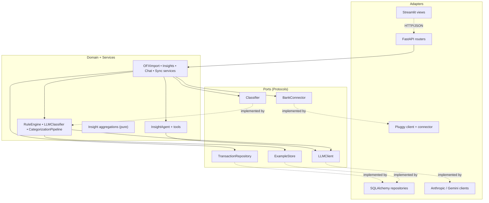

# Gastei

> A 21st-century spreadsheet. Personal finance assistant that imports bank statements, auto-categorizes transactions with AI, and lets you query your money in plain language.

[](https://github.com/GuiBarradas/Gastei/actions/workflows/ci.yml)
[](https://www.python.org/)
[](https://fastapi.tiangolo.com/)
[](https://www.sqlalchemy.org/)
[](https://streamlit.io/)
[](LICENSE)
[](https://docs.astral.sh/ruff/)

---

## What it does

Single-user app for personal finance management, built for the Brazilian banking system. **Import statements** (manual OFX or Open Finance via Pluggy), **AI categorizes everything automatically**, and **you talk to your data** through chat — "how much did I spend on delivery in April?", "what was my biggest expense last month?".

Not a SaaS. A vitamin-pumped spreadsheet that lives on your machine.

```
Import OFX from your bank          ──────►   78 new, 12 duplicates (idempotent)
Categorize: rules → LLM            ──────►   auto-classified, LLM only for the ambiguous
Ask in chat                        ──────►   "You spent BRL 487 on delivery in April,
                                              18% above your average."
```

## Highlights

- **Hexagonal architecture that actually holds.** The core depends on 5 `Protocol` ports; SQL, HTTP, Anthropic, Gemini, Pluggy, and Streamlit live behind adapters. Swapping Claude for Gemini is a one-file adapter — and both ship, switchable via `LLM_PROVIDER`.
- **Deterministic before probabilistic.** 80+ Brazilian merchant rules run first (free, instant, explainable); the LLM only sees what rules missed — with the user's own past corrections as few-shot examples.
- **Fails gracefully.** If the LLM provider is down (503/429/quota), a circuit breaker degrades the pipeline to rules-only instead of failing the batch: one failed call, not twenty timeouts, and everything rules can label still gets labeled.
- **A feedback loop that learns.** Every manual recategorization is persisted and fed back to the LLM as a few-shot on the next batch.
- **Idempotent ingestion.** Deterministic SHA-256 transaction IDs — re-importing the same OFX 100 times never duplicates a row.
- **Tested where it matters.** 200+ tests: pure TDD in the domain, real SQLite + FastAPI TestClient in integration, contract tests against live provider APIs, Streamlit smoke tests.

## Stack

| Layer | Technology | Why |
|---|---|---|
| Backend API | **FastAPI** + **SQLAlchemy 2.0** + **Alembic** | Native async, Pydantic validation, versioned migrations |
| Frontend MVP | **Streamlit** + **Plotly** | UI without boilerplate; swappable for Next.js without touching the domain |
| Database | **SQLite** (WAL) | Single-user scales to tens of thousands of tx; Postgres is a URL change away |
| LLM | **Anthropic Claude** or **Google Gemini** | Chosen via `LLM_PROVIDER`; classification on the fast tier, chat on the smart tier |
| Open Finance | **Pluggy** (sandbox) | The regulated flow; manual OFX covers real usage |
| Background | **APScheduler** | Auto-sync every N hours, opt-in |
| Tooling | **uv**, **ruff**, **pytest**, **pre-commit**, **Docker** | Modern Python toolchain |

## Architecture — Ports & Adapters

The business core (`domain/`, `services/`) **does not know** SQL, HTTP, the Anthropic SDK, Pluggy, or Streamlit exist. It depends on **Protocols** (ports); concrete adapters implement them. The full architectural document is [`ARCHITECTURE.md`](./ARCHITECTURE.md).



**Outcome:** swapping SQLite for Postgres, Pluggy for Belvo, Streamlit for Next.js, or Claude for Gemini means rewriting one adapter — the domain stays untouched.

## Categorization pipeline

```
New transaction
   |
   +-- 1. RuleEngine (YAML rules, deterministic)        -> source='rule', confidence=1.0
   |       substring | regex | merchant_exact, priority-ordered
   |
   +-- 2. LLMClassifier (Haiku / Gemini Flash Lite)     -> source='llm', confidence=0.0-1.0
   |       Tool use with hand-written JSON Schema, taxonomy-validated,
   |       user corrections injected as few-shot examples.
   |       Provider down? Circuit breaker -> rules-only, no failed batch.
   |
   +-- 3. Manual correction in the UI                   -> source='user', becomes few-shot
```

**Cost:** ~$0.001 per 50 transactions on Haiku. **Free** on Gemini Flash Lite (free tier).

## Chat with your data

The `InsightAgent` runs a tool-use loop (max 8 iterations) against four tools backed by real aggregations — `get_spending_by_category`, `get_top_merchants`, `get_monthly_summary`, `list_uncategorized`. Every numerical claim in an answer comes from a tool call; the system prompt forbids invented values. Conversations and tool traces persist in SQLite and render in the UI as expandable blocks.

## Quick start

Prerequisite: [uv](https://docs.astral.sh/uv/) (`winget install astral-sh.uv` / `curl -LsSf https://astral.sh/uv/install.sh | sh`).

```bash
git clone https://github.com/GuiBarradas/Gastei.git
cd Gastei
cp .env.example .env        # set LLM_PROVIDER + the matching API key (Gemini is free)

uv sync
uv run alembic upgrade head

uv run uvicorn gastei.api.main:app --reload     # API   -> localhost:8000
uv run streamlit run streamlit_app/app.py       # UI    -> localhost:8501
```

Or with Docker:

```bash
cp .env.example .env
docker compose up --build   # migrations run automatically
```

### LLM provider

| Provider | Cost | Key |
|---|---|---|
| `gemini` | **Free** (no card) | https://aistudio.google.com/apikey |
| `anthropic` | $5 trial, then paid | https://console.anthropic.com/settings/keys |

With no key configured, `/chat` returns 503 and categorization degrades to rules-only — the rest of the app keeps working.

## Project layout

```
gastei/
├── ARCHITECTURE.md                # the authoritative spec — design, contracts, testing strategy
├── alembic/                       # versioned migrations (schema + taxonomy seed)
├── seeds/
│   ├── categories.yaml            # hierarchical taxonomy (pt-BR labels, stable codes)
│   └── rules.yaml                 # 80+ deterministic rules for Brazilian merchants
├── src/gastei/
│   ├── config.py                  # pydantic-settings, the single env entry point
│   ├── db.py                      # engine, WAL + FK pragmas
│   ├── models/                    # SQLAlchemy ORM
│   ├── schemas/                   # Pydantic DTOs (no SQLAlchemy dependency)
│   ├── domain/
│   │   ├── ports.py               # 5 Protocols — the architectural seam
│   │   ├── categorizer/           # RuleEngine, LLMClassifier, CategorizationPipeline
│   │   └── insights/              # pure aggregation functions
│   ├── repositories/              # SQLAlchemy adapters implementing the ports
│   ├── services/                  # OFX import, insights, chat, sync orchestration
│   ├── agents/                    # InsightAgent + tool definitions
│   ├── clients/                   # Anthropic, Gemini, Pluggy adapters
│   ├── api/                       # FastAPI routers + dependency composition
│   ├── jobs/                      # APScheduler sync job
│   └── utils/                     # bank codes, OFX inspector, log redaction
├── streamlit_app/
│   ├── app.py                     # st.navigation router (theme, health check)
│   ├── views/                     # home, dashboard, transações, chat, conexões
│   └── components/                # API client + design tokens / chart chrome
└── tests/
    ├── unit/                      # pure tests, written test-first
    ├── integration/               # real SQLite + FastAPI TestClient + AppTest smoke
    ├── contract/                  # live provider APIs (skip without keys)
    └── fakes/                     # one in-memory fake per port
```

## Tests

```bash
uv run pytest                                       # unit + integration (fast, no network)
uv run pytest -m contract                           # against real provider APIs (needs keys)
uv run pytest --cov=gastei --cov-report=term        # coverage
```

The testing strategy is layered (ARCHITECTURE.md §8): TDD with fakes where the logic lives (`domain/`, `services/`), real-infrastructure integration tests for adapters, contract tests for third-party APIs, smoke tests for the UI. No ORM mocking, no mocking types we don't own.

## Technical decisions

1. **SQLite until it hurts.** Single-user handles tens of thousands of tx; migrating to Postgres is a URL change.
2. **Deterministic before probabilistic** — in cost *and* in failure. Rules are free and instant; the LLM is the fallback, and when it's down the pipeline degrades instead of dying.
3. **Idempotency required.** `sha256(account_id | date | amount | normalized_description)` as the transaction ID.
4. **No LangChain.** The provider SDKs are enough; the tool-use loop is ~50 lines you can read.
5. **Explicit JSON Schema for tool use** — full control over what the LLM sees, no Pydantic internals leaking into prompts.
6. **Secrets never in git; PII never in logs.** `.env` is ignored; the `gastei` logger masks API keys, CPF, and account-like digit runs (`utils/logging.py`).

More context — including the trade-offs and the roads deliberately not taken — in [`ARCHITECTURE.md`](./ARCHITECTURE.md) §12.

## Roadmap

- **Phase 1 — done:** OFX import, dashboard, transactions
- **Phase 2 — done:** rules + LLM categorization, chat with tool use, feedback loop
- **Phase 3 — done:** Open Finance (Pluggy), scheduled sync, Docker, deploy guide
- **Phase 4 — out of scope here:** multi-user, mobile, budget alerts ([`ARCHITECTURE.md`](./ARCHITECTURE.md) §10)

## Security

- `.env` never enters git; optional `SECRET_KEY` (Fernet) for sensitive fields at rest
- Log redaction for API keys, CPF, and account numbers, attached at app startup
- Single-user by design — for remote access use Tailscale or Cloudflare Tunnel, never expose the port
- See [`SECURITY.md`](./SECURITY.md)

## License

MIT — see [`LICENSE`](./LICENSE).
